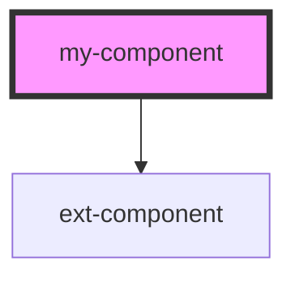

# ext-component

<!-- Auto Generated Below -->

## Properties

| Property     | Attribute    | Description | Type     | Default     |
| ------------ | ------------ | ----------- | -------- | ----------- |
| `salutation` | `salutation` | something   | `string` | `undefined` |

## Dependencies

### Depends on

- ext-component

### Graph

----------------------------------------------

*Built with [StencilJS](https://stenciljs.com/)*
